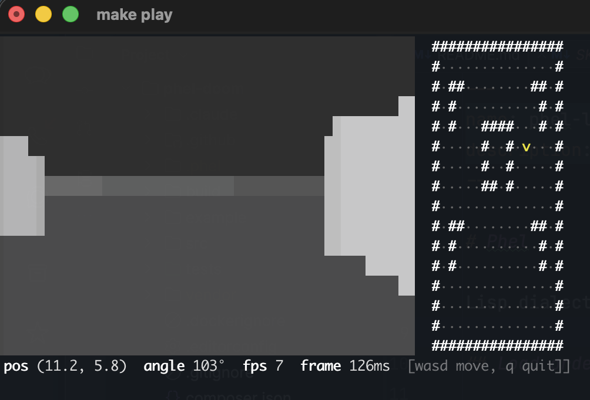

# phel-doom



A DOOM-lite raycaster in your terminal, written in [Phel Lang](https://phel-lang.org/), a functional Lisp on PHP.

## Features

- 256-color ANSI raycaster, full-terminal viewport (FOV scales, walls don't)
- Procedurally generated map per run
- Chasing enemies with hitscan combat, blood splatter, muzzle flash
- Lives + i-frames + kill counter, "YOU DIED" on game over
- Live minimap, HUD (lives, kills, pos, heading, fps, frame ms)
- Pure-functional world state, single `loop`/`recur` game loop
- ~440 fps at 80×24, ~210 fps at 180×40

## Requirements

- PHP **>= 8.4**
- [Composer](https://getcomposer.org/)
- 256-color ANSI terminal

## Quick start

```bash
git clone git@github.com:Chemaclass/phel-doom.git
cd phel-doom
make install
make play
```

`composer install` / `composer play` work too.

## Controls

| Key       | Action              |
|-----------|---------------------|
| `w` / `s` | Move forward / back |
| `a` / `d` | Strafe left / right |
| `←` / `→` | Turn left / right   |
| `space`   | Fire                |
| `e`       | Open door in front  |
| `m`       | Toggle minimap      |
| `p`       | Pause / resume      |
| `q`       | Quit                |

Inputs layer freely: `w` + `a` + `→` walks forward, strafes left, pans view right.

## Project layout

```
src/
├── main.phel                 ; CLI entrypoint + Application wiring
├── commands/play.phel        ; subcommand: play (game loop)
└── modules/
    ├── state.phel            ; player + world records, pure updates
    ├── map.phel              ; procedural grid + wall lookup
    ├── engine.phel           ; raycaster (step march)
    ├── enemy.phel            ; spawn, chase AI, hitscan
    ├── render.phel           ; ANSI frame + minimap + HUD
    └── input.phel            ; raw STDIN, non-blocking key reads
tests/modules/                ; unit tests per module
phel-config.php               ; build / export / format config
```

## Architecture

```
┌─────────────┐    ┌───────────┐    ┌────────────┐    ┌─────────────────────┐
│ input.phel  │───▶│ state.phel│───▶│ engine.phel│───▶│ render.phel         │
│ drain-keys  │    │ pure step │    │ raycast    │    │ viewport+minimap+HUD│
└─────────────┘    └───────────┘    └────────────┘    └─────────────────────┘
                         ▲                 ▲
                         │                 │
                         └── enemy.phel ───┘
                             chase + shoot
```

Per frame in `commands/play.phel`:

1. `render!` paints viewport + minimap + HUD in one ANSI write.
2. `drain-keys` reads queued STDIN bytes (held key = multiple steps).
3. `apply-physics` folds inputs into the world; `advance` walks enemies.
4. `damage-step` ticks i-frames and applies touch damage.

Render time is the throttle; 1ms `usleep` only yields the CPU.

## Performance

Per-frame `frame->string` on the bundled bench (32×22 map, minimap on):
~2 ms (80×24), ~3 ms (120×30), ~5 ms (180×40). Loop is bounded by
`stty size` + `microtime` overhead, not the raycaster.

Hot per-cell loop pushed off Phel's polymorphic runtime onto direct PHP ops:

- `php/aget`, `php/+`, `php/<`, `php/*` etc. compile to PHP subscript / operator emission, skipping the runtime dispatch path.
- `cast-frame` returns a flat PHP array of distances; renderer walks it by index, no lazy seq.
- 24 grayscale ANSI strings baked into `shade-table`, so per-cell shade is one `php/aget`.
- Viewport row run-length encoded into a PHP array, `php/implode`'d once. No `(str acc ...)` chain.
- Minimap reads `:pgrid` (PHP-native nested array) instead of Phel persistent vectors.
- Alternate screen buffer + cursor-home redraw + autowrap off, so frames overwrite in place.

`proj-dist` is decoupled from viewport width: each ray's angular offset is `atan(col-offset / proj-dist)`, so resizing the terminal widens the FOV instead of zooming the walls.

## Development

```bash
composer test          # phel tests
composer format        # auto-format
composer lint          # phel-lint
composer build         # out/main.php standalone
composer repl          # interactive REPL
```

## Roadmap

- [x] Raycaster + procedural map + player movement & collision
- [x] Live minimap, HUD, full-terminal viewport
- [x] Enemies (chase AI, hitscan, lives, i-frames, blood, muzzle flash)
- [x] Doors (closed cells you open with E)
- [x] WAD file parser (header + directory + VERTEXES/LINEDEFS lumps)
- [x] Sound (terminal bell on shoot / hit / door open; `ext-ffi`+miniaudio left as a future swap)

## License

MIT
